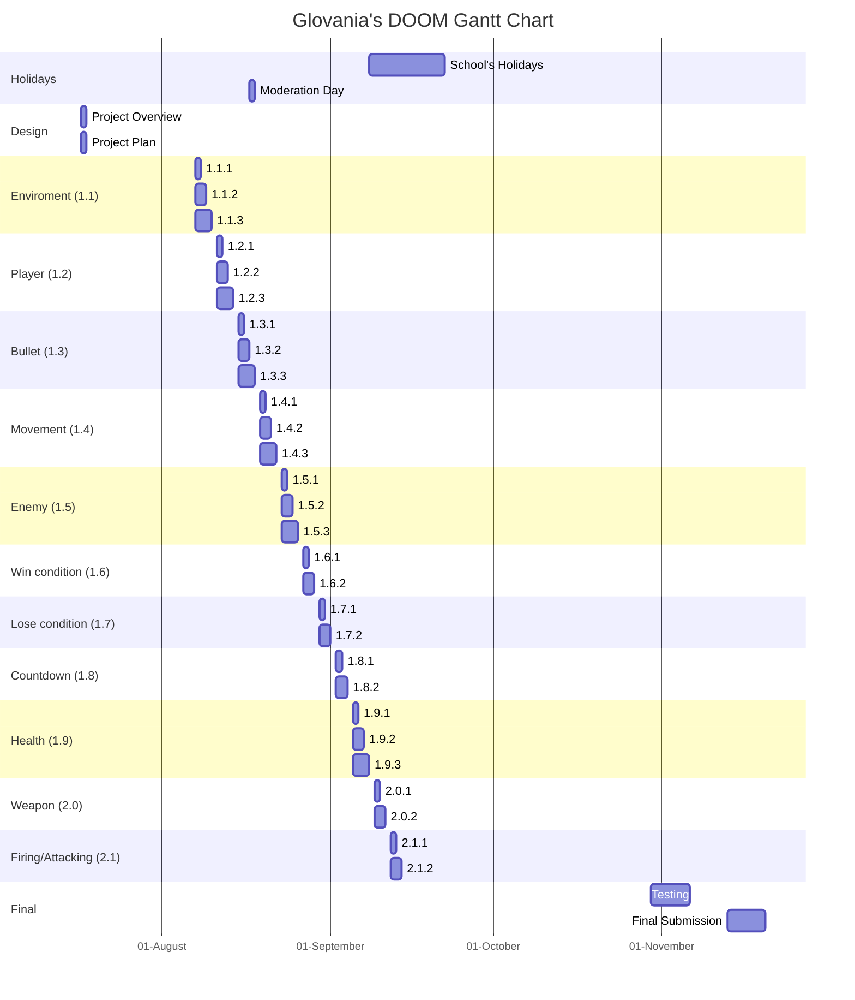

```mermaid
gantt
    title Glovania's DOOM Gantt Chart
    dateFormat DD-MM-YYYY
    axisFormat %d-%B
    tickInterval 1month


    section Holidays
    School's Holidays: 08-09-2023, 14d
    Moderation Day: 17-08-2023, 1d


    section Design
    Project Overview: 17-07-2023, 1d
    Project Plan: 17-07-2023, 1d


    section Enviroment (1.1)
    1.1.1: 07-08-2023, 1d
    1.1.2: 07-08-2023, 2d
    1.1.3: 07-08-2023, 3d


    section Player (1.2)
    1.2.1: 11-08-2023, 1d
    1.2.2: 11-08-2023, 2d
    1.2.3: 11-08-2023, 3d


    section Bullet (1.3)
    1.3.1: 15-08-2023, 1d
    1.3.2: 15-08-2023, 2d
    1.3.3: 15-08-2023, 3d


    section Movement (1.4)
    1.4.1: 19-08-2023, 1d
    1.4.2: 19-08-2023, 2d
    1.4.3: 19-08-2023, 3d


    section Enemy (1.5)
    1.5.1: 23-08-2023, 1d
    1.5.2: 23-08-2023, 2d
    1.5.3: 23-08-2023, 3d


    section Win condition (1.6)
    1.6.1: 27-08-2023, 1d
    1.6.2: 27-08-2023, 2d


    section Lose condition (1.7)
    1.7.1: 30-08-2023, 1d
    1.7.2: 30-08-2023, 2d
 

    section Countdown (1.8)
    1.8.1: 02-09-2023, 1d
    1.8.2: 02-09-2023, 2d


    section Health (1.9)
    1.9.1: 05-09-2023, 1d
    1.9.2: 05-09-2023, 2d
    1.9.3: 05-09-2023, 3d


    section Weapon (2.0)
    2.0.1: 09-09-2023, 1d
    2.0.2: 09-09-2023, 2d


    section Firing/Attacking (2.1)
    2.1.1: 12-09-2023, 1d
    2.1.2: 12-09-2023, 2d


    section Final
    Testing: 30-10-2023, 7d
    Final Submission: 13-11-2023, 7d
```