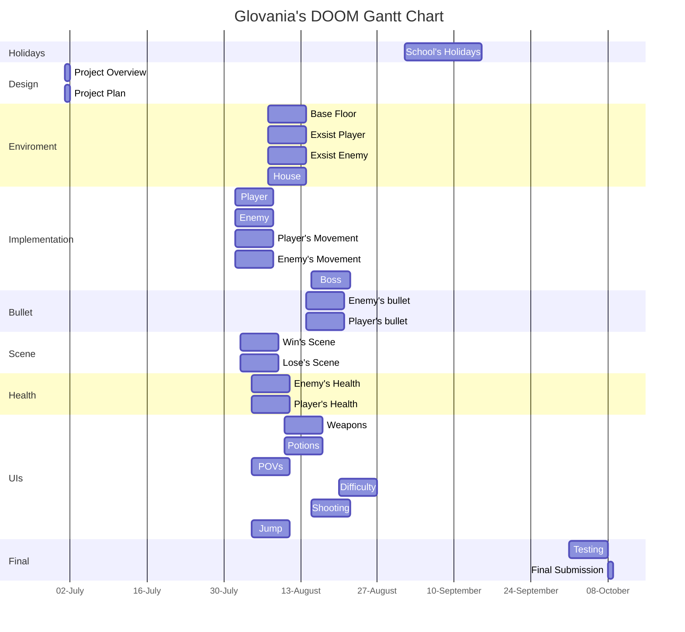

```mermaid
gantt
    title Glovania's DOOM Gantt Chart
    dateFormat DD-MM-YYYY
    axisFormat %d-%B
    tickInterval 2week


    section Holidays
    School's Holidays: 01-09-2023, 14d


    section Design
    Project Overview: 01-07-2023, 1d
    Project Plan: 01-07-2023, 1d


    section Enviroment
    Base Floor: 07-08-2023,7d
    Exsist Player: 07-08-2023, 7d
    Exsist Enemy: 07-08-2023, 7d
    House: 07-08-2023, 7d


    section Implementation
    Player: 01-08-2023, 7d
    Enemy: 01-08-2023, 7d
    Player's Movement: 01-08-2023, 7d
    Enemy's Movement: 01-08-2023, 7d
    Boss: 15-08-2023, 7d


    section Bullet
    Enemy's bullet: 14-08-2023, 7d
    Player's bullet: 14-08-2023, 7d


    section Scene
    Win's Scene: 02-08-2023, 7d
    Lose's Scene: 02-08-2023, 7d


    section Health
    Enemy's Health: 04-08-2023, 7d
    Player's Health: 04-08-2023, 7d


    section UIs
    Weapons: 10-08-2023, 7d
    Potions: 10-08-2023, 7d
    POVs: 04-08-2023, 7d
    Difficulty: 20-08-2023, 7d
    Shooting: 15-08-2023, 7d
    Jump: 04-08-2023, 7d


    section Final
    Testing: 01-10-2023, 7d
    Final Submission: 08-10-2023, 1d
```